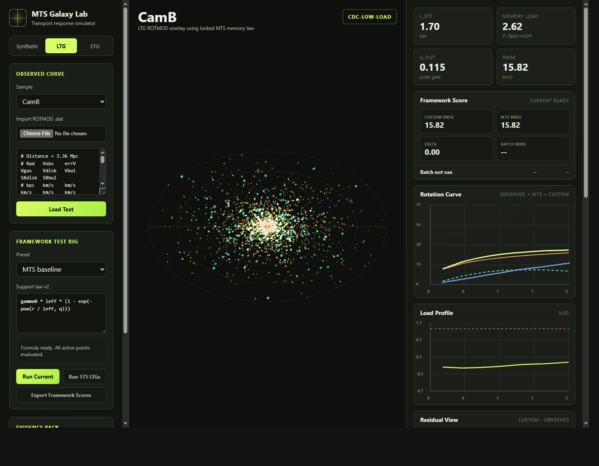

# MTS Galaxy Lab

A zero-install browser workbench for exploring galaxy rotation curves, model overlays, route diagnostics, and custom support-law experiments.

This repo is designed to be opened, inspected, modified, and tested without any build system. Open `index.html` in a browser and the lab is ready to use.



## What the tool does

MTS Galaxy Lab is not only an MTS demo. It is a small static research lab for comparing rotation-curve behaviour across synthetic galaxies, bundled LTG samples, bundled ETG samples, and user-supplied ROTMOD text.

You can use it to:

- build a toy galaxy with live sliders for disk, gas, bulge, radius, gas fraction, and transport exponent;
- browse 175 bundled LTG/SPARC-style rotation-curve samples;
- browse 16 bundled ETG/ATLAS3D-style samples with high-resolution disk and bulge components;
- import or paste your own ROTMOD-style `.dat` text;
- compare baryonic, baseline, and custom support-law curves on the same plot;
- batch-score a custom formula across all bundled LTG samples;
- export CSV, JSON, SVG, and standalone diagnostic HTML sheets for audit/review.

The locked MTS calculation is included as the baseline model and as one preset in the framework test rig. Other formulae can be entered and tested against it without changing the source code.

## Quick start

Download or clone the repo, then open:

```text
index.html
```

That is all. The app is plain HTML, CSS, and JavaScript.

No Node. No npm. No Python. No local server required.

For GitHub Pages, publish the repository root and set `index.html` as the entry page.

## Main modes

### 1. Synthetic

Interactive toy-galaxy mode. Use this when you want to see how the model responds as galaxy structure changes.

Controls include:

- disk scale length `h`;
- outer radius `r_out`;
- disk, gas, and bulge velocity-load sliders;
- outer gas fraction;
- transport exponent `q`;
- particle animation speed;
- optional transport-support-only view.

### 2. LTG

Observed late-type-galaxy browser mode.

The app loads 175 bundled ROTMOD-style samples from `data/samples.js`. You can search, filter, sort, and hunt for specific route classes or diagnostic behaviour.

LTG tools include:

- sample selector;
- ROTMOD `.dat` import;
- pasted ROTMOD text loader;
- route summary chips;
- searchable galaxy browser;
- sort by RMSE, `u_out`, Priority-L MAE, `x_cross`, or name;
- quick filters for Late-load, CDC, Single, Infeasible, Worst, and Best cases.

### 3. ETG

Early-type-galaxy diagnostic mode.

The app loads 16 bundled ETG samples from `data/etg-samples.js`, including high-resolution disk and bulge component tables. ETG mode shows Stage-4 style outer-chain diagnostics and residual markers.

## Framework Test Rig

The Framework Test Rig lets you test alternate support laws without overwriting the locked baseline.

You can select a preset or type a restricted math expression for the support contribution `v2`, measured in `(km/s)^2`. The app then computes:

```text
V_custom = sqrt(V_bar^2 + v2)
```

and compares it against the active observed or synthetic curve.

Bundled presets:

```text
MTS baseline
Baryon only
Soft radial support
Outer gate support
Observed residual check
```

You can also batch-score the current formula across all 175 LTG samples and export the result as CSV.

### Formula variables

The formula editor accepts these variables:

```text
r, x, h, rOut, fGas, fGasOut, leff, memory, q
 gamma0, rMax, mlDisk, mlBulge
vGas, vDisk, vBulge, vBar, vObs, uObs
pi, e
```

Allowed functions:

```text
abs, sqrt, pow, exp, log, log10, min, max
sin, cos, tan, tanh, atan, atan2, floor, ceil, round
```

The editor is intentionally limited to math expressions, not general JavaScript.

## Baseline calculations

The app includes a locked baseline calculation so that custom formulae have a stable reference curve.

Constants:

```text
Gamma0 = 809.956
Rmax   = 1.758948
ML_disk = 0.5
ML_bulge = 0.7
q = 0.77 for ROTMOD mode
```

Baryonic contribution:

```text
V_bar^2 = V_gas^2 + 0.5 V_disk^2 + 0.7 V_bulge^2
```

Memory/transport quantities:

```text
S_mem = (0.9 / pi) * (r_out / h)
memory_load = (1 - f_gas_out) * (r_out / h)
L_eff = 1.8 h * (1 + S_mem * (1 - exp(-memory_load / S_mem)))
```

Baseline velocity model:

```text
V_model^2(r) = V_bar^2(r) + Gamma0 * L_eff * (1 - exp(-(r / L_eff)^q))
```

Diagnostic `u(r)`:

```text
u(r) = (V_obs^2 - 0.5 V_disk^2 - 0.7 V_bulge^2) / (Gamma0 * r * Rmax)
```

In Synthetic mode, `V_obs` is the generated synthetic model. In LTG/ROTMOD mode, `V_obs` is the observed input velocity.

## Diagnostics shown in the app

The right-hand rail displays live values for the active galaxy, including:

- `L_eff`;
- memory load;
- `u_out`;
- RMSE;
- route diagnostics;
- framework score;
- residual plot.

For LTG samples, the browser also exposes route labels and ranking metrics so that outliers and special cases can be found quickly.

For ETG samples, the app uses locked table values for `h`, `R90`, `Sigma80-100`, and `logy`; `R80` is computed live from the bundled high-resolution disk profile.

## Evidence exports

The Evidence Pack buttons export the active state of the lab:

| Export | Output |
|---|---|
| Current CSV | Point-by-point active curve table with radii, velocities, `u(r)`, residuals, and framework values when active |
| LTG Index CSV | Current filtered/sorted LTG browser diagnostics |
| Summary JSON | Active galaxy constants, curve state, route state, framework state, and browser filters |
| Plot SVG | Standalone rotation-curve SVG |
| Diagnostic Sheet | Standalone HTML sheet with metrics, plots, route diagnostics, and residuals |
| Framework Scores CSV | Batch results for the current custom formula across all bundled LTGs |

These exports are meant to make screenshots and one-off checks easier to audit later.

## Data and regeneration scripts

Bundled browser data lives in:

```text
data/samples.js       # 175 LTG samples
data/etg-samples.js   # 16 ETG samples
```

The repo also includes PowerShell scripts for regenerating those bundled JavaScript files from local source archives:

```powershell
powershell -NoProfile -ExecutionPolicy Bypass -File .\scripts\export-samples.ps1 -ZipPath "C:\path\to\Rotmod_LTG (4).zip"

powershell -NoProfile -ExecutionPolicy Bypass -File .\scripts\export-etg-samples.ps1 -ZipPath "C:\path\to\Rotmod_ETG.zip"
```

The app itself only needs the generated JavaScript sample files. The original archive paths are not required at runtime.

## Project structure

```text
index.html                    # App shell and controls
styles.css                    # Layout, panels, plots, responsive styling
app.js                        # Simulation, parsing, diagnostics, plotting, exports, framework rig
data/samples.js               # Bundled LTG sample data
data/etg-samples.js           # Bundled ETG sample data
scripts/export-samples.ps1    # LTG bundle regeneration script
scripts/export-etg-samples.ps1# ETG bundle regeneration script
qa-*.png                      # Local QA screenshots
README.md                     # This file
```

## Local verification notes

The included `qa-*.png` files are browser QA screenshots from local runs. They cover desktop, mobile, LTG, ETG, evidence-export, and framework-test views.

A local browser click test also ran the Framework Test Rig across all 175 LTGs with the baryon-only preset and confirmed that the batch table updated.

## Contributing / modifying

This project is intentionally small and hackable.

Good first modifications:

- add a new framework preset in `FRAMEWORK_PRESETS` inside `app.js`;
- adjust visual styling in `styles.css`;
- add more export fields in the evidence-pack functions;
- regenerate the bundled sample files from updated ROTMOD archives;
- add more QA screenshots after browser changes.

When changing the baseline calculation, keep the constants and formula section in this README in sync with `app.js` so exported results remain understandable.

## License / data note

Add the repository license here before publishing publicly. If the bundled galaxy samples are derived from external survey/source archives, include the appropriate dataset citation and redistribution terms for those sources in the repo as well.
